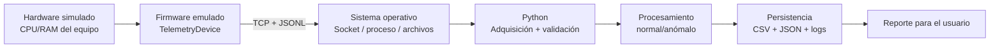

# Integración_de_SI_Corte_2
Autor: Enrique Molina. Actividad: Solución al taller del segundo corte del espacio académico Integración de Sistemas de Información respecto a la integración de Hardware, Software y Firmware

## Actividad de integración HSF
Prototipo de integración Hardware, Firmware y Software para la práctica del Anexo N. 3 de la ruta de aprendizaje. Funciona sin dispositivos físicos: `simulator.py` emula un dispositivo que publica telemetría JSON por TCP y `app.py` recibe, valida, clasifica, almacena y reporta los datos.

## Documentación y video
- Documento: `/docs/Ing%20en%20inform%C3%A1tica_Informe%20Corte%202_Integraci%C3%B3n%20de%20SI_Enrique%20Molina_C%C3%B3digo%202343906.pdf`
- Video: `docs/architecture.mmd`: diagrama editable.
- Matriz de pruebas: `docs/matriz_pruebas.md`

## Arquitectura



- **Hardware:** recursos reales del equipo y la señal sintética del dispositivo.
- **Firmware:** `src/hsf_telemetry/simulator.py`; identifica el dispositivo y produce temperatura, vibración y voltaje.
- **SO:** sockets TCP, proceso Python, memoria y almacenamiento consultados mediante `psutil`/`platform`.
- **Software:** `src/hsf_telemetry/app.py` y sus módulos.

## Instalación y ejecución

```powershell
py -m venv .venv
.\.venv\Scripts\Activate.ps1
py -m pip install -r requirements.txt
py -m pip install -e .
py -m hsf_telemetry.cli demo --messages 12 --interval 0.15
```

En Linux active el entorno con `source .venv/bin/activate` y use `python` en lugar de `py`.

La demo deja evidencias en `output/`: `telemetry.csv`, `summary.json` y `hsf.log`.

Para ejecutar los componentes por separado:

```powershell
py -m hsf_telemetry.cli simulator --messages 20 --interval 0.5
py -m hsf_telemetry.cli app --duration 12
```

## Fallos controlados

La aplicación mantiene el control ante:

1. JSON corrupto: registra `invalid_payload` y continúa.
2. Variable fuera de rango: registra `out_of_range`, persiste el evento rechazado y continúa.
3. Desconexión: registra `communication_lost` y finaliza el ciclo con estado controlado.
4. Ruta de salida inaccesible: captura `OSError` y conserva el resultado en memoria/log.

Ejemplo de prueba de fallos:

```powershell
py -m pytest -q
```
